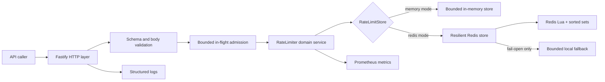
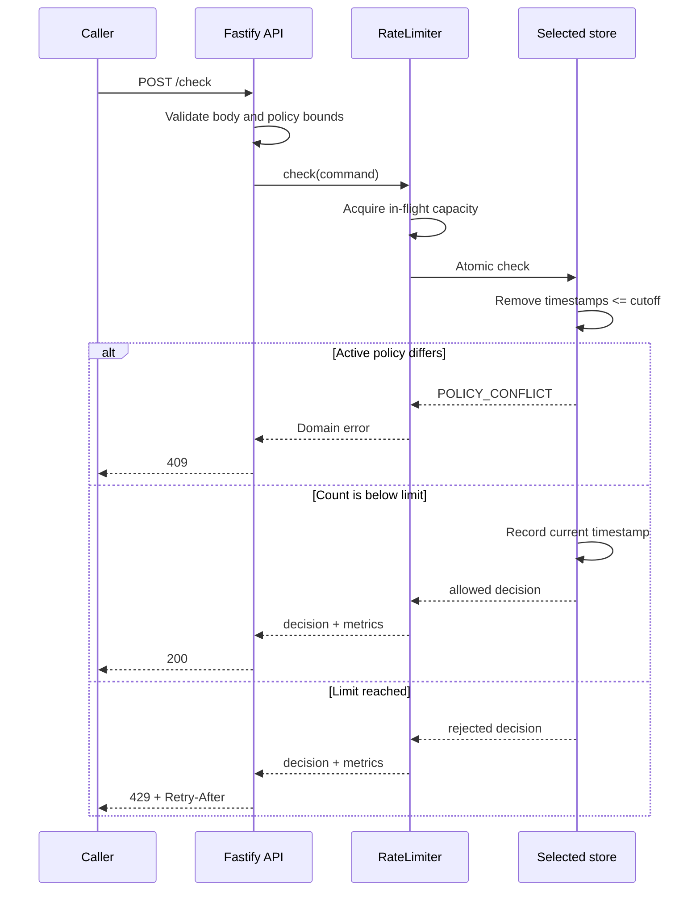
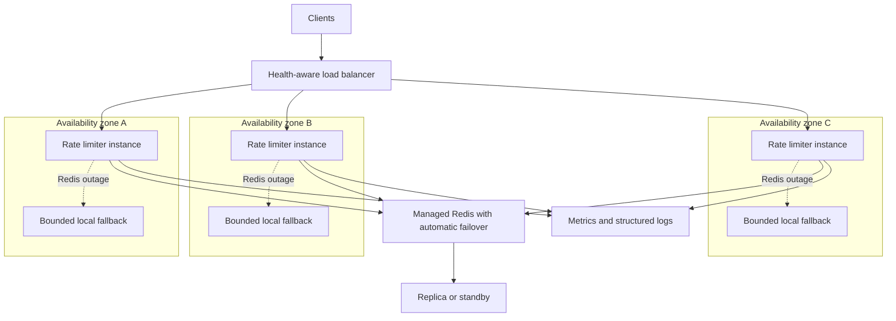
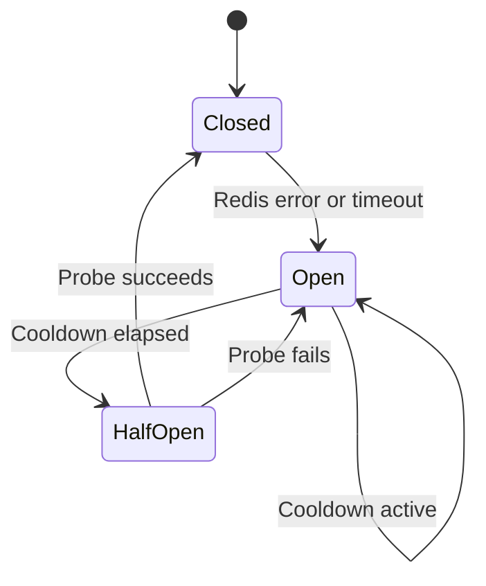

# API Rate Limiting Service

A standalone Node.js and TypeScript service that makes an exact sliding-window rate-limit decision for each client. It is designed as an onboarding-friendly reference for correctness, bounded resource use, Redis-backed coordination, and availability-aware failure handling.

## Start here

### What the service does

Send a client identifier and policy to `POST /check`. The service uses its own clock, removes expired requests, and atomically allows or rejects the current request.

```json
{
  "clientId": "client-123",
  "limit": 100,
  "windowMs": 60000
}
```

The active interval is exactly `(now - windowMs, now]`. A timestamp at the cutoff has expired. A client's `limit` and `windowMs` remain locked while that client has active timestamps; changing either value during that period returns `409 POLICY_CONFLICT`.

### Run locally in memory mode

Requirements:

- Node.js 24.21.x
- npm
- Docker only if you want Redis or the containerized service

```bash
npm ci
npm run build
npm start
```

The default configuration listens on `http://localhost:3000` and stores state in the current process.

In another terminal:

```bash
curl --request POST http://localhost:3000/check \
  --header 'content-type: application/json' \
  --data '{"clientId":"client-123","limit":2,"windowMs":60000}'
```

An allowed response looks like:

```json
{
  "allowed": true,
  "remaining": 1,
  "resetAt": 1791561660000,
  "mode": "memory"
}
```

`resetAt` is an example Unix epoch timestamp; the real value is generated by the service clock.

### Run with Redis

Start Redis, then run the service in distributed mode:

```bash
docker compose up -d redis
STORE_MODE=redis REDIS_URL=redis://localhost:6379 npm start
```

Or build and start both containers:

```bash
docker compose --profile app up --build
```

Stop and remove local containers with:

```bash
docker compose --profile app down
```

## System design

### Component architecture



The HTTP layer owns validation and status-code mapping. The domain service owns admission and observation. Both storage implementations share the same interface, keeping Fastify and Redis concerns out of the rate-limit algorithm.

### Request decision flow



Memory mode uses a `Map` and a head-indexed timestamp queue for amortized O(1) maintenance. Redis mode uses a sorted set per client and one Lua script so expiry, counting, insertion, policy validation, and TTL updates are atomic. Redis supplies the authoritative time for consistent decisions across service instances.

### Production availability topology



This is the recommended production shape, not infrastructure created by this repository. Local Docker Compose intentionally provides one Redis instance. A production deployment should use at least three stateless service instances across failure zones, a health-aware load balancer, autoscaling, and Redis with automatic failover.

The availability target is 99.99% monthly service availability within a capacity-tested envelope. No finite system can guarantee availability under unlimited traffic. Hard in-flight and state limits prevent overload from becoming an unbounded queue or process crash.

## API guide

| Endpoint | Purpose | Healthy response |
| --- | --- | --- |
| `POST /check` | Evaluate and record a request | `200` allowed or `429` policy-rejected |
| `GET /health` | Report store and circuit health | `200` healthy/degraded; `503` unhealthy |
| `GET /metrics` | Expose Prometheus metrics | `200` text exposition |

### Decision status codes

| Status | Meaning |
| --- | --- |
| `200` | The request is allowed and has been recorded. |
| `400` | Input failed schema validation. |
| `409` | The client tried to change an active policy. |
| `413` | The JSON body exceeded 8 KiB. |
| `429` | The client reached its policy limit. This is a successful limiter decision. |
| `503` | Processing/state capacity is exhausted, or Redis failed under fail-closed mode. |

A rejected decision includes `retryAfterMs`, `resetAt`, and the HTTP `Retry-After` header:

```json
{
  "allowed": false,
  "remaining": 0,
  "resetAt": 1791561660000,
  "retryAfterMs": 42110,
  "mode": "redis"
}
```

Client IDs must contain 1–128 characters from `A-Z`, `a-z`, `0-9`, `.`, `_`, `:`, and `-`. Caller-provided timestamps and unknown properties are rejected.

## Storage and failure modes

| Mode | Coordination | Intended use |
| --- | --- | --- |
| `memory` | One Node.js process | Local development, tests, or a deliberately single-instance deployment |
| `redis` | Shared atomic state | Multiple service instances requiring globally consistent enforcement |
| `fallback` | Per-process bounded memory | Temporary degraded operation after Redis failure in fail-open mode |

Redis mode wraps the primary store with a timeout and circuit breaker:



- `FAILURE_POLICY=open` preserves request-path availability with local fallback. Limits are temporarily per instance, so global enforcement is weaker until Redis recovers.
- `FAILURE_POLICY=closed` preserves centralized enforcement and returns `503` while Redis is unavailable.
- Redis client offline queuing is disabled, preventing an implicit unbounded backlog.
- Active clients are never evicted merely to admit a new client because eviction would reset their allowance.

## Configuration

All settings are environment variables. Defaults are listed in `.env.example` and applied directly by the configuration loader; the service does not automatically load the `.env` file.

| Variable | Default | Purpose |
| --- | ---: | --- |
| `HOST` | `0.0.0.0` | Listen address |
| `PORT` | `3000` | Listen port |
| `LOG_LEVEL` | `info` | Fastify log level |
| `STORE_MODE` | `memory` | `memory` or `redis` |
| `REDIS_URL` | — | Required when `STORE_MODE=redis` |
| `FAILURE_POLICY` | `open` | `open` for fallback or `closed` for rejection |
| `MAX_CLIENTS` | `100000` | Maximum locally tracked clients |
| `MAX_TOTAL_TIMESTAMPS` | `1000000` | Maximum retained local timestamps |
| `MAX_TIMESTAMPS_PER_CLIENT` | `10000` | Per-client local timestamp bound |
| `MAX_LIMIT` | `10000` | Maximum accepted request policy limit |
| `MIN_WINDOW_MS` | `100` | Minimum accepted window |
| `MAX_WINDOW_MS` | `3600000` | Maximum accepted window |
| `CLEANUP_INTERVAL_MS` | `30000` | Inactive-state cleanup interval |
| `MAX_IN_FLIGHT` | `1000` | Concurrent `/check` ceiling |
| `REDIS_TIMEOUT_MS` | `100` | Redis operation timeout |
| `CIRCUIT_COOLDOWN_MS` | `5000` | Delay before a Redis recovery probe |

When setting related bounds, `MAX_LIMIT` must not exceed `MAX_TIMESTAMPS_PER_CLIENT`, which must not exceed `MAX_TOTAL_TIMESTAMPS`.

## Observability

`GET /health` is kept outside `/check` admission accounting so an overloaded request path remains observable. In fail-open fallback mode it returns HTTP `200` with `status: "degraded"`; in fail-closed Redis failure it returns HTTP `503` with `status: "unhealthy"`.

`GET /metrics` includes Node.js process metrics and:

- `rate_limiter_requests_total`
- `rate_limiter_allowed_total`
- `rate_limiter_rejected_total`
- `rate_limiter_latency_seconds`
- `rate_limiter_store_errors_total`
- `rate_limiter_overload_rejections_total`
- `rate_limiter_fallback_total`
- `rate_limiter_circuit_state`
- `rate_limiter_active_clients`

Metrics use operating mode, outcome, and stable error categories as labels. Client IDs are intentionally excluded to avoid high-cardinality metrics and leaking identifiers.

## Tests and verification

```bash
npm run typecheck
npm run build
npm test
```

The regular suite tests the algorithm, capacity controls, circuit breaker, API contract, and metrics. Run the real Redis integration suite with Redis listening on port 6379:

```bash
docker compose up -d redis
npm run test:redis
docker compose down
```

CI runs type-checking, compilation, the complete Jest suite, and real Redis integration tests on every push to `main` and on pull requests.

## Code map for new contributors

| Area | Responsibility |
| --- | --- |
| `src/api/` | Request schemas, routes, and HTTP response mapping |
| `src/domain/` | Store interfaces, decisions, errors, admission, and orchestration |
| `src/algorithms/` | Head-indexed timestamp queue |
| `src/stores/in-memory-store.ts` | Exact local sliding-window state and memory bounds |
| `src/stores/redis-script.ts` | Atomic Redis algorithm |
| `src/stores/redis-store.ts` | Redis keying and script result mapping |
| `src/stores/resilient-store.ts` | Timeout, circuit breaker, and failure policy |
| `src/metrics/` | Private Prometheus registry and limiter metrics |
| `src/app.ts` | Dependency construction and Fastify lifecycle |
| `src/server.ts` | Process startup and graceful shutdown |
| `tests/unit/` | Deterministic component and algorithm tests |
| `tests/integration/` | HTTP contract and real Redis behavior |

A useful reading order is: domain types, timestamp queue, in-memory store, Redis Lua script, resilient store, rate limiter, then the API composition in `app.ts`.

## Design boundaries

- Memory mode is exact only inside one process. Use Redis when multiple instances must share a limit.
- Fail-open fallback prioritizes API availability but cannot preserve a single global counter during a shared Redis outage.
- The exact sliding log costs O(active requests) space. Configured bounds make that cost explicit.
- `429` is a policy outcome, not service unavailability. Timeouts, connection failures, and `5xx` responses are availability failures.
- Graceful shutdown handles `SIGINT` and `SIGTERM`, stops cleanup, closes stores, and lets Fastify finish its lifecycle.
